# Backtest Report: 29% SPYL / 10% IS3N / 10% MEUD / 9% 8PSB / 8% XB29 / 6% IB27 / 5% SGLD / 5% EUNN / 5% BNK / 4% CSPXJ / 4% XCAN / 4% XEON

**Date**: 2026-03-16
**Source**: [backtes.to](https://backtes.to/)

---

## Portfolio Allocation

| Asset | ISIN | Weight |
|-------|------|--------|
| SPYL | IE000XZSV718 | 28.83% |
| IS3N | IE00BKM4GZ66 | 10.32% |
| MEUD | LU0908500753 | 10.32% |
| 8PSB | IE00B43VDT70 | 8.73% |
| XB29 | LU2673523309 | 7.80% |
| IB27 | IE000ZOI8OK5 | 6.08% |
| SGLD | IE00B579F325 | 5.42% |
| EUNN | IE00B4L5YX21 | 5.42% |
| BNK | LU1834983477 | 4.50% |
| CSPXJ | IE00B52MJY50 | 4.37% |
| XCAN | LU0476289540 | 4.37% |
| XEON | LU0290358497 | 3.84% |

---

## Settings

- **Period**: 12/2023 – 11/2025 (max available for all assets)
- **Initial investment**: EUR 10,000
- **Recurring**: none
- **Rebalancing**: none

---

## Performance Summary

| Metric | Value |
|--------|-------|
| CAGR (Rendimento Annuale) | 20.4% |
| Volatility | 7.4% |
| Sharpe Ratio | 2.76 |
| Max Drawdown | -5.9% |
| Average Drawdown | -0.6% |
| Max Drawdown Duration | 0.4 years |
| Ulcer Index | 1.49% |

---

## Portfolio Value

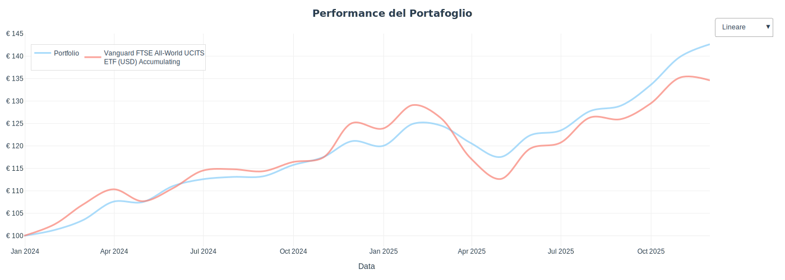

---

## Rolling Returns

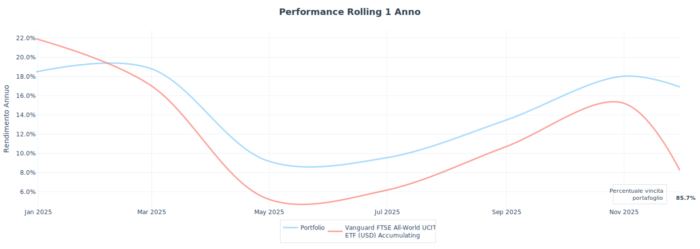

---

## Yearly Returns

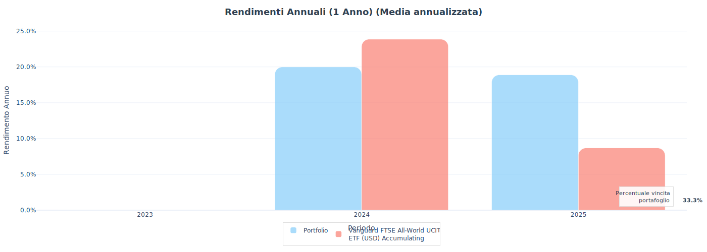

| Year | Return |
|------|--------|
| 2024 | +20.4% |
| 2025 | +20.4% |

> Note: Only 2 full years of data available (12/2023 – 11/2025). Annual returns are annualized CAGR equivalents.

---

## Return Distribution

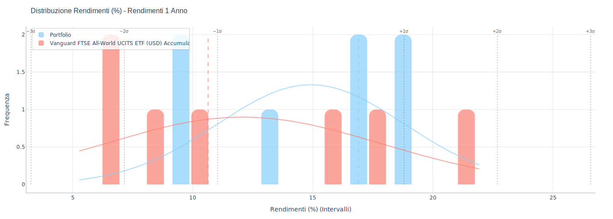

---

## Risk Analysis

> Monte Carlo simulation, max loss, and success probability charts require >2 years of data. The analysis period (12/2023 – 11/2025) is too short for accurate Monte Carlo calculations.

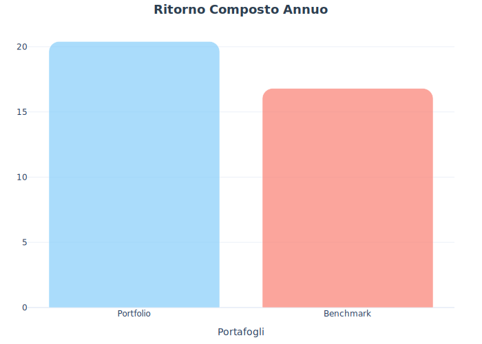
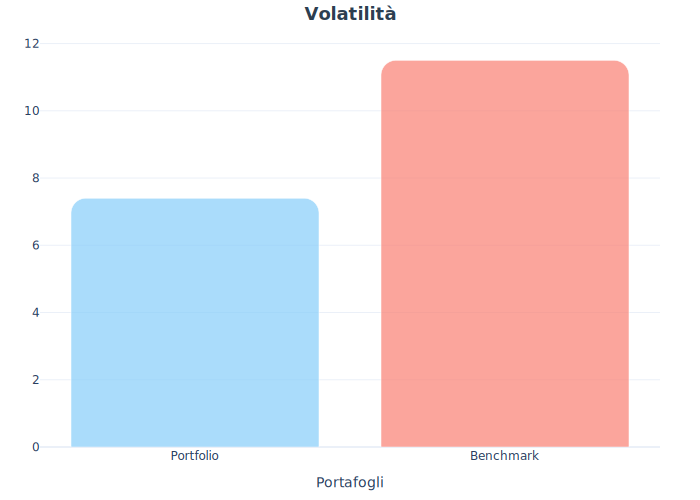
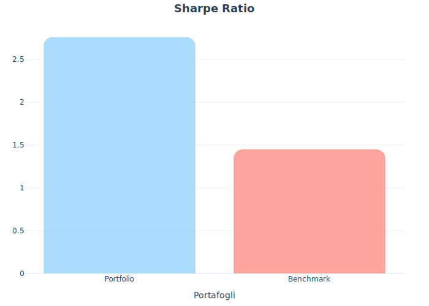

---

## Drawdown Analysis

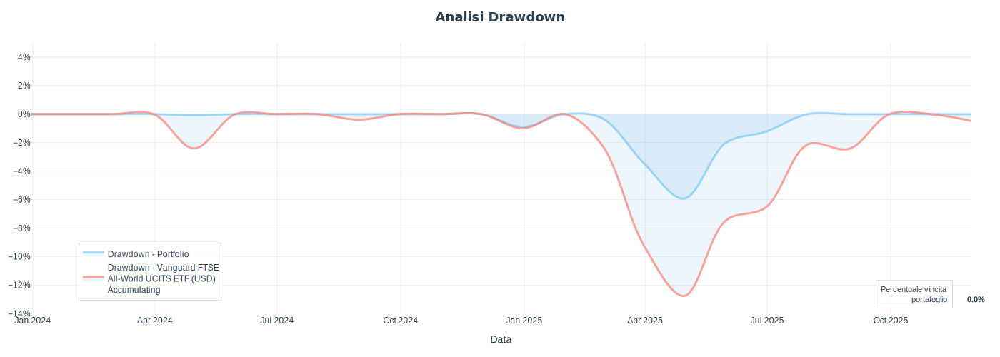

---

## Top 10 Holdings

| Holding | Weight |
|---------|--------|
| NVIDIA CORP | 2.53% |
| MICROSOFT CORP | 2.04% |
| APPLE INC | 1.86% |
| AMAZON COM INC | 1.12% |
| TAIWAN SEMICONDUCTOR | 0.95% |
| META PLATFORMS INC | 0.89% |
| BROADCOM INC | 0.77% |
| ALPHABET INC CLASS A | 0.62% |
| SAP | 0.57% |
| BERKSHIRE HATHAWAY INC | 0.56% |

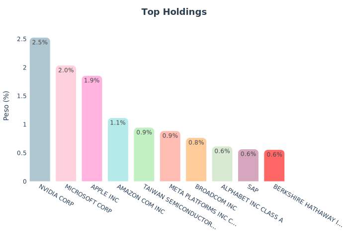

---

## Portfolio Composition

### Country

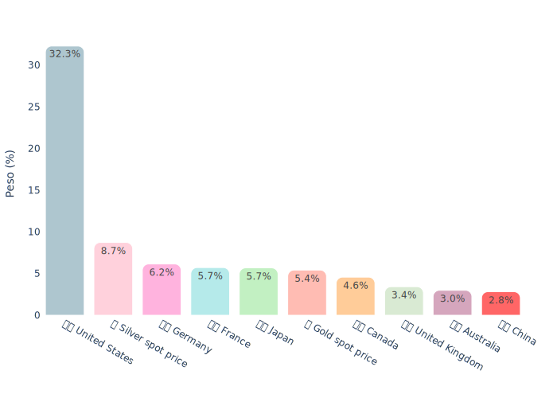

| Category | Weight |
|----------|--------|
| 🇺🇸 United States | 32.3% |
| 🏳️ Silver spot price | 8.7% |
| 🇩🇪 Germany | 6.2% |
| 🇫🇷 France | 5.7% |
| 🇯🇵 Japan | 5.7% |
| 🏳️ Gold spot price | 5.4% |
| 🇨🇦 Canada | 4.6% |
| 🇬🇧 United Kingdom | 3.4% |
| 🇦🇺 Australia | 3.0% |
| 🇨🇳 China | 2.8% |

### Continent

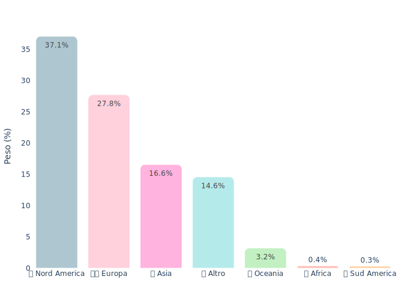

| Category | Weight |
|----------|--------|
| 🌎 Nord America | 37.1% |
| 🇪🇺 Europa | 27.8% |
| 🌏 Asia | 16.6% |
| 🌐 Altro | 14.6% |
| 🌏 Oceania | 3.2% |
| 🌍 Africa | 0.4% |
| 🌎 Sud America | 0.3% |

### Market Type

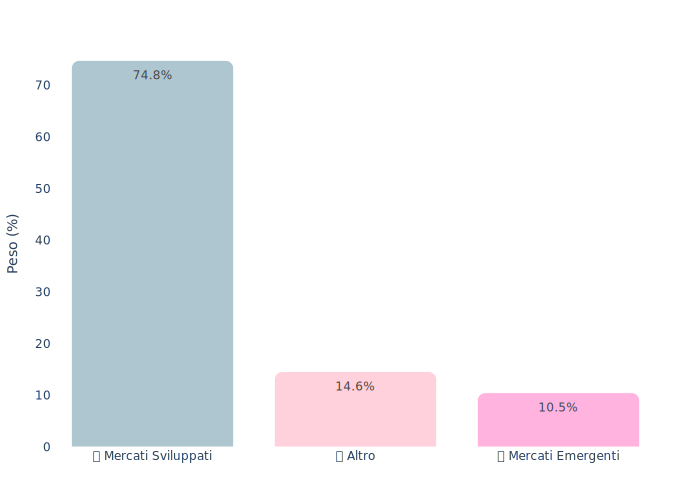

| Category | Weight |
|----------|--------|
| 🏛️ Mercati Sviluppati | 74.8% |
| ❓ Altro | 14.6% |
| 🚀 Mercati Emergenti | 10.5% |

### Currency

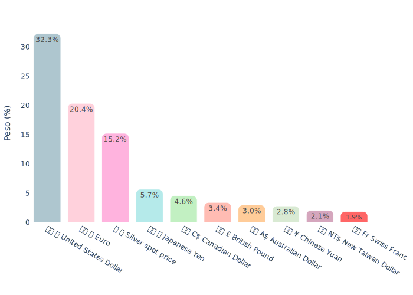

| Category | Weight |
|----------|--------|
| 🇺🇸 💵 United States Dollar | 32.3% |
| 🇪🇺 💶 Euro | 20.4% |
| 🌍 💱 Silver spot price | 15.2% |
| 🇯🇵 💴 Japanese Yen | 5.7% |
| 🇨🇦 C$ Canadian Dollar | 4.6% |
| 🇬🇧 £ British Pound | 3.4% |
| 🇦🇺 A$ Australian Dollar | 3.0% |
| 🇨🇳 ¥ Chinese Yuan | 2.8% |
| 🇹🇼 NT$ New Taiwan Dollar | 2.1% |
| 🇨🇭 Fr Swiss Franc | 1.9% |

### Sector

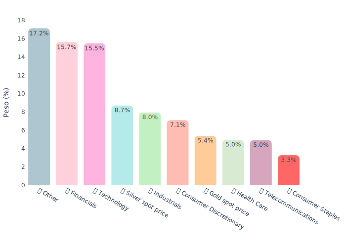

| Category | Weight |
|----------|--------|
| 📊 Other | 17.2% |
| 💰 Financials | 15.7% |
| 💻 Technology | 15.5% |
| 📈 Silver spot price | 8.7% |
| 🏭 Industrials | 8.0% |
| 🛍️ Consumer Discretionary | 7.1% |
| 📈 Gold spot price | 5.4% |
| 🏥 Health Care | 5.0% |
| 📱 Telecommunications | 5.0% |
| 🛒 Consumer Staples | 3.3% |

---

## Benchmark Comparison

- **Benchmark**: Vanguard FTSE All-World UCITS ETF (USD) Accumulating (VWCE, IE00BK5BQT80)
- **Mode**: Single ETF

### Performance Comparison

| Metric | Portfolio | Benchmark (VWCE) |
|--------|-----------|------------------|
| CAGR | 20.4% | — |
| Volatility | 7.4% | — |
| Sharpe Ratio | 2.76 | — |
| Max Drawdown | -5.9% | -12.8% |
| Avg Drawdown | -0.6% | -2.0% |
| Max DD Duration | 0.4 years | 0.6 years |
| Ulcer Index | 1.49% | 3.92% |
| Correlation | 0.897 | — |

### Rolling Correlation

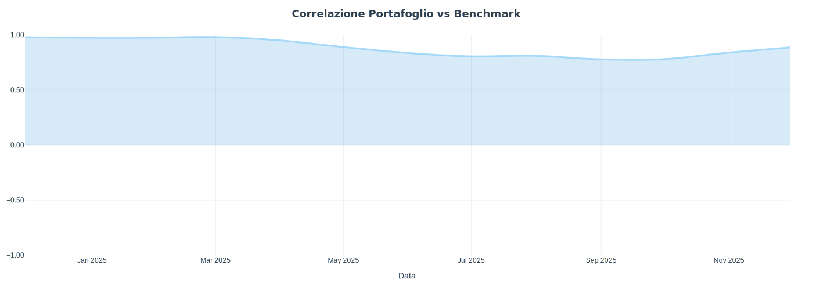

### Return Scatter

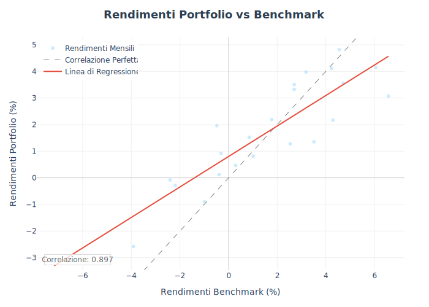

### Correlation Matrix

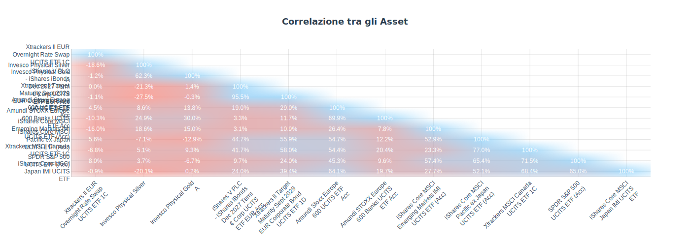

### Holdings Overlap

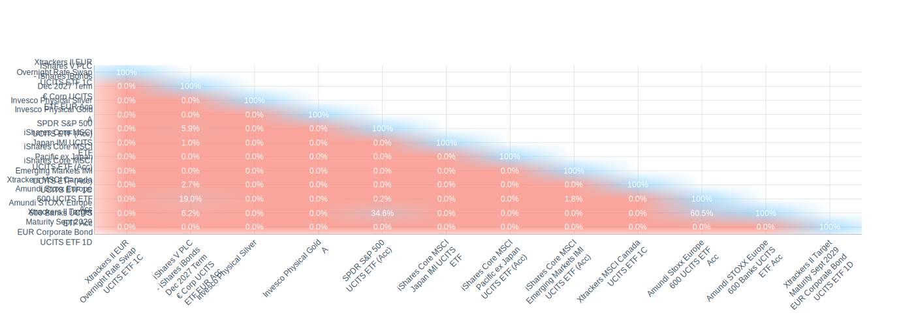

---

## Efficient Frontier

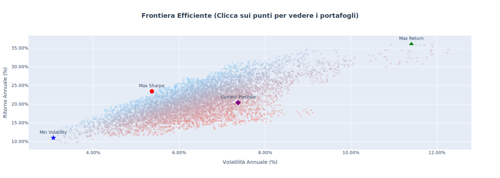

---

## Dani Score

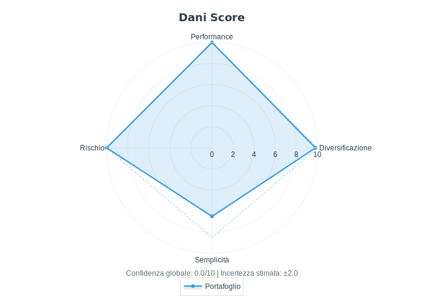

| Dimension | Score |
|-----------|-------|
| Diversificazione | 9.82 |
| Performance | 10.00 |
| Rischio | 10.00 |
| Semplicità | 6.50 |

---

*Report generated by backtesto-agent*
