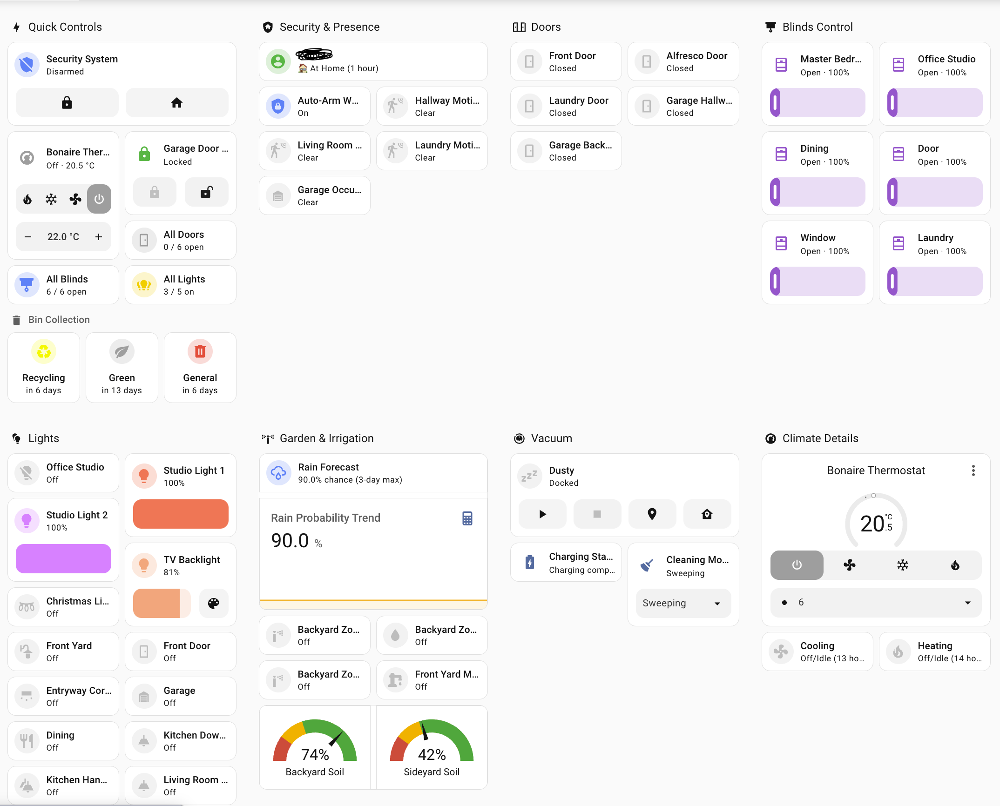

# Home Assistant Manager - Claude Code Skill

> Expert-level Home Assistant configuration management with efficient deployment workflows, remote CLI access, automation verification, and comprehensive Lovelace dashboard development.

[](https://github.com/anthropics/claude-code)
[](https://www.home-assistant.io/)
[](LICENSE)


*Example tablet-optimized dashboard built using this skill - touch-friendly controls, color-coded status, and responsive grid layout*

## 🎬 See It In Action

### Quick Skill Check
Verify Claude can see and use this skill:

https://github.com/user-attachments/assets/a215df83-ce84-4ed2-bb93-f3a3ee0c43e8

*Shows Claude recognizing the skill and loading Home Assistant expertise*

### Full Workflow Demo
Watch the complete workflow in action - end to end (3x speed):


https://github.com/user-attachments/assets/eab53b18-ae2b-4d43-b1e4-e45bf9357099

*Complete automation development cycle including deployment, testing, log analysis, and git workflow*

## 🚀 What This Skill Does

This Claude Code skill transforms Claude into a **Home Assistant expert** that helps you:

### Configuration Management
- **Rapid Development Workflow**: Deploy changes via `scp` for instant testing, commit to git when stable
- **Smart Reload vs Restart**: Automatically determines whether to reload or restart based on change type
- **Configuration Validation**: Always validates before applying changes to prevent downtime
- **Remote CLI Access**: Seamlessly manages HA instances via SSH and `hass-cli`

### Automation Development
- **Complete Verification Protocol**: Automatically tests automations by triggering manually and checking logs
- **Error Detection**: Identifies template errors, type mismatches, and execution failures
- **Log Analysis Patterns**: Knows what success and error indicators to look for
- **Iterative Fix Workflow**: Guides through debugging and re-testing cycles

### Lovelace Dashboard Development
- **Tablet Optimization**: Creates touch-friendly dashboards optimized for specific screen sizes (7", 11", 13")
- **Card Type Expertise**: Knows when to use Mushroom cards, Tile cards, Panel vs Sections views
- **Template Patterns**: Provides ready-to-use Jinja2 templates for common use cases:
  - Door/window counting with color coding
  - Conditional display based on time/state
  - Multi-condition status indicators
- **Common Pitfall Solutions**: Solves dashboard registration, auto-entities failures, template type errors
- **Real-World Examples**: Includes working examples from production tablet dashboards

### Workflow Optimization
- **Git + scp Hybrid**: Uses git for version control, scp for rapid iteration
- **No Restart for Dashboards**: Deploys dashboard changes with just browser refresh
- **Context7 Integration**: Leverages official HA documentation via MCP when available
- **Deployment Decision Tree**: Guides through the optimal workflow based on change type

## 📦 Installation

### Prerequisites

1. **Claude Code** installed and configured
2. **Home Assistant** instance with:
   - SSH access enabled
   - Git repository connected to `/config` directory
3. **Local tools**:
   - `hass-cli` installed (`pipx install homeassistant-cli`)
   - SSH key authentication configured
   - Environment variables set: `HASS_SERVER`, `HASS_TOKEN`

### Install the Skill

#### Option 1: Clone into your Home Assistant config repository

```bash
cd /path/to/your/homeassistant/config
mkdir -p .claude/skills
cd .claude/skills
git clone git@github.com:komal-SkyNET/claude-skill-homeassistant.git home-assistant-manager
```

#### Option 2: Download and extract

```bash
cd /path/to/your/homeassistant/config
mkdir -p .claude/skills/home-assistant-manager
cd .claude/skills/home-assistant-manager
curl -L https://github.com/komal-SkyNET/claude-skill-homeassistant/archive/main.tar.gz | tar xz --strip-components=1
```

### Verify Installation

The skill should appear when you start Claude Code in your Home Assistant repository. Claude will automatically load the skill and apply the expertise.

## 🎯 Usage Examples

### Example 1: Create a New Automation

```
User: "Create an automation that sends a notification when the front door
       is left open for more than 5 minutes"

Claude: [Uses skill to]:
1. Create automation YAML with proper syntax
2. Deploy via scp for testing
3. Reload automations (no restart needed)
4. Manually trigger to test
5. Check logs for execution
6. Verify notification received
7. Commit to git when working
```

### Example 2: Build a Tablet Dashboard

```
User: "Create a dashboard for my 11-inch tablet in the living room
       with lights, thermostat, and door status"

Claude: [Uses skill to]:
1. Create new dashboard file in .storage/
2. Register in lovelace_dashboards
3. Use 3-column grid layout (optimal for 11")
4. Add Mushroom cards for touch-friendly controls
5. Create template card with door counting
6. Deploy via scp for instant preview
7. Iterate on layout based on feedback
8. Commit when finalized
```

### Example 3: Debug a Template Error

```
User: "My automation has a TypeError about comparing str and int"

Claude: [Uses skill to]:
1. Check logs for exact error message
2. Identify template needs | int filter
3. Fix the template syntax
4. Deploy via scp
5. Trigger manually to verify
6. Check logs confirm no errors
7. Commit the fix
```

## 🏗️ Skill Architecture

This skill provides expertise in three core areas:

### 1. Remote Access Patterns
- `hass-cli` commands with environment variables
- SSH-based `ha` CLI commands
- Log analysis and error detection
- State verification

### 2. Deployment Workflows
- **Git workflow**: For final, tested changes
- **scp workflow**: For rapid iteration (dashboards, testing)
- **Reload vs Restart**: Smart decision making
- **Verification protocols**: Always check outcomes

### 3. Dashboard Development
- **View types**: Panel (full-screen) vs Sections (organized)
- **Card types**: Mushroom, Tile, Template, Auto-entities
- **Template patterns**: Jinja2 snippets for common use cases
- **Debugging**: JSON validation, template testing, entity verification

## 🤝 Contributing

We welcome contributions from the Home Assistant community! This skill has been developed through real-world usage and we want to keep improving it.

### What to Contribute

**🎯 Focus on Home Assistant-specific expertise:**

✅ **GOOD contributions:**
- New template patterns for common use cases
- Solutions to specific HA configuration pitfalls
- Dashboard card examples for different devices
- Integration-specific deployment workflows
- Automation verification patterns
- Log analysis patterns for specific errors

❌ **AVOID generic contributions:**
- General git workflows (unless HA-specific)
- Generic Python/YAML best practices
- Non-HA development workflows

### Contribution Guidelines

#### 1. Template Pattern Contributions

Add to the "Common Template Patterns" section:

```markdown
**Your Pattern Name:**
```jinja2

{{ your_template_logic }}
```

**Use case:** Explain when to use this
**Example output:** Show what it produces
```

#### 2. Dashboard Card Examples

Add to "Real-World Examples":

```markdown
### Your Card Name
```json
{
  "type": "...",
  ...
}
```

**Best for:** Device type, use case
**Features:** What makes this example useful
```

#### 3. Pitfall Solutions

Add to "Common Pitfalls":

```markdown
**Problem X: Brief description**
- **Symptom:** What the user sees
- **Cause:** Root cause explanation
- **Fix:** Step-by-step solution
```

#### 4. Workflow Improvements

If proposing workflow changes:
- Explain the problem with current workflow
- Provide specific HA scenario where it applies
- Show before/after comparison
- Include verification steps

### How to Submit

1. **Fork the repository**
2. **Create a feature branch**: `git checkout -b feature/your-contribution-name`
3. **Make your changes** to `SKILL.md`
4. **Test thoroughly** in your own HA environment
5. **Update README.md** if adding new capabilities
6. **Submit a Pull Request** with:
   - Clear description of what you're adding
   - Example usage scenario
   - Verification that it works in real HA setup

### Contribution Review Process

PRs are reviewed for:
- ✅ **HA-specific value**: Does it solve a real HA problem?
- ✅ **Accuracy**: Is the information correct and up-to-date?
- ✅ **Clarity**: Is it well-documented and easy to understand?
- ✅ **Tested**: Has it been verified in a real HA environment?

## 📚 Skill Structure

```
home-assistant-manager/
├── SKILL.md          # Main skill content with YAML frontmatter
├── README.md         # This file
└── LICENSE           # MIT License
```

The skill follows the [official Claude skills specification](https://github.com/anthropics/skills):
- `SKILL.md` contains YAML frontmatter with `name` and `description`
- Content organized in logical sections
- Includes examples, patterns, and workflows
- Focused on actionable expertise

## 🔧 Environment Setup

For the skill to work optimally, ensure your environment has:

### SSH Access
```bash
# Test SSH access
ssh root@homeassistant.local "ha core info"
```

### hass-cli Setup
```bash
# Install hass-cli
pipx install homeassistant-cli

# Set environment variables (add to ~/.bashrc or ~/.zshrc)
export HASS_SERVER=http://homeassistant.local:8123
export HASS_TOKEN=your_long_lived_access_token

# Test hass-cli
hass-cli state list
```

### Git Repository
```bash
# Your HA config should be a git repository
cd /config
git init
git remote add origin your-repo-url

# Claude should be run from this directory
```

### Context7 MCP (Optional but Recommended)
```bash
# Add Context7 for official HA documentation
claude mcp add --transport http context7 https://mcp.context7.com/mcp \
  --header "CONTEXT7_API_KEY: your_api_key"
```

## 🎨 Use Cases

### DevOps & Configuration Management
- Rapid automation development and testing
- Safe configuration changes with validation
- Remote HA instance management
- Git-based version control workflow

### Dashboard Development
- Tablet-optimized control panels
- Wall-mounted dashboard displays
- Mobile-responsive layouts
- Touch-friendly interface design

### Template Development
- Jinja2 template creation and debugging
- Dynamic sensor calculations
- Conditional automation logic
- Custom card configurations

### Troubleshooting
- Log analysis and error detection
- Template type error resolution
- Dashboard debugging
- Integration configuration issues

## 📖 Related Resources

- [Official Claude Skills Repository](https://github.com/anthropics/skills)
- [Home Assistant Documentation](https://www.home-assistant.io/docs/)
- [Lovelace UI Documentation](https://www.home-assistant.io/lovelace/)
- [Home Assistant Community](https://community.home-assistant.io/)

## 📄 License

MIT License - See [LICENSE](LICENSE) file for details.

## 👤 Author

**Komal Venkatesh Ganesan**

If you find this skill helpful for managing your Home Assistant setup, consider supporting its development:

<a href="https://www.buymeacoffee.com/komalvenkag" target="_blank"></a>

## 💬 Support & Discussion

- **Issues**: [GitHub Issues](https://github.com/komal-SkyNET/claude-skill-homeassistant/issues)
- **Discussions**: [GitHub Discussions](https://github.com/komal-SkyNET/claude-skill-homeassistant/discussions)
- **Home Assistant Community**: Tag contributions with `claude-skill`

---

**Made with ❤️ for the Home Assistant community**
