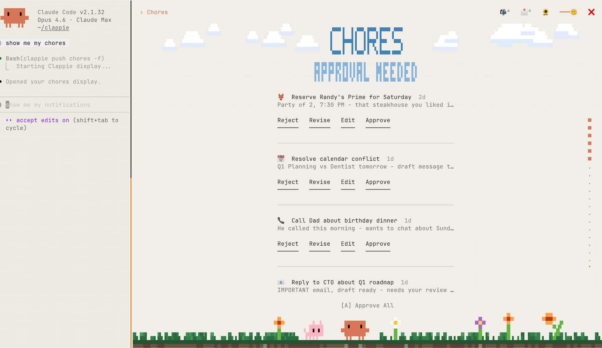
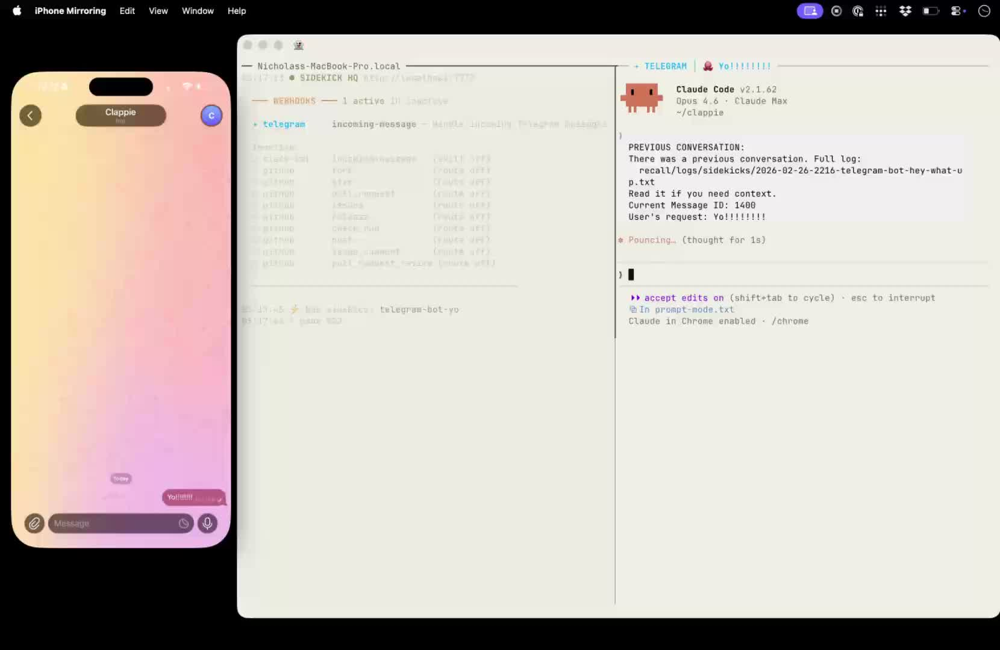
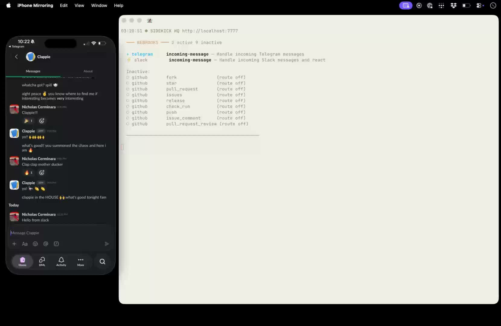
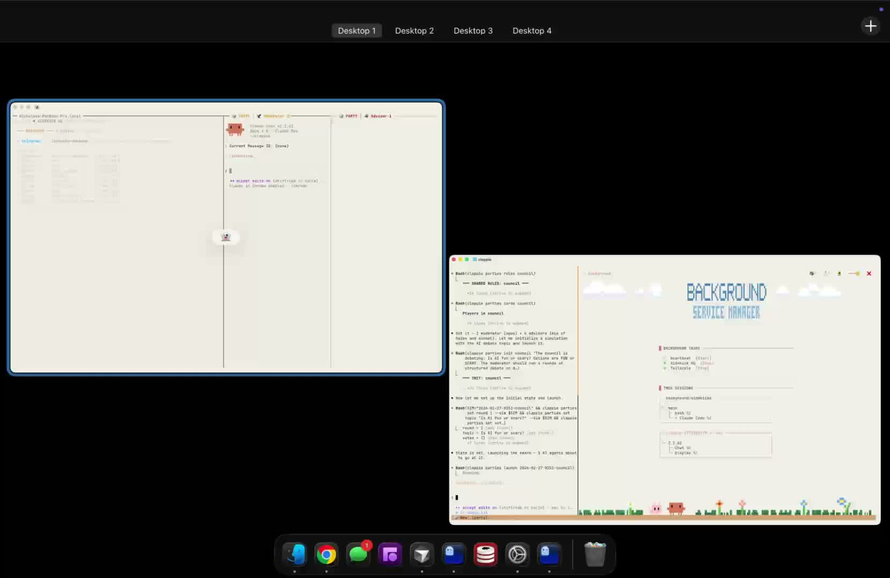

# Clappie

Turn Claude Code into a 24/7 personal agent you can text from your phone. Terminal UIs, background agents, cron jobs, notifications, memory — one skill file, zero infrastructure.

Claude Code is incredible. But it stops when you close the lid. What if it could run background tasks while you sleep? Text you when something's urgent? Remember everything about you? Show interactive terminal UIs? Spawn parallel agents to handle work?

That's Clappie. One skill file. Tiny. Hackable. Yours.

---

## Docs

Full setup guide, features, and integrations: **[clappie.ai](https://clappie.ai)**

## License

MIT
